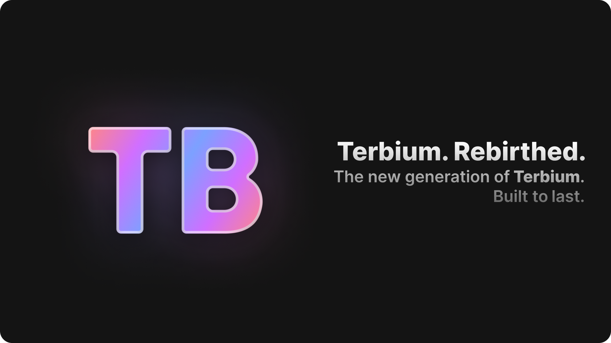

Directly support SNOOT and the TerbiumOS team

## Projects

- [Legacy Terbium WebOS](https://github.com/terbiumos/webOS) - The original version of Terbium webOS
- [Terbium WebOS v2](https://github.com/terbiumos/web-v2) - The next generation of Terbium webOS
- [TML Lang](https://github.com/terbiumos/tml) (WIP) - A HTML like markup language to build native apps on Terbium webOS v2
- [App Repo](https://github.com/terbiumos/app-repo) - The application repository for Terbium webOS v2

## Devs
- [SNOOT (Founder)](https://github.com/NovaAppsInc)
- [XSTARS](https://github.com/Notplayingallday383)
- [Illusions](https://github.com/illusionTBA)
- [Rafflesia](https://github.com/ProgrammerIn-wonderland)
- [Riftriot](https://github.com/Riftriot)
